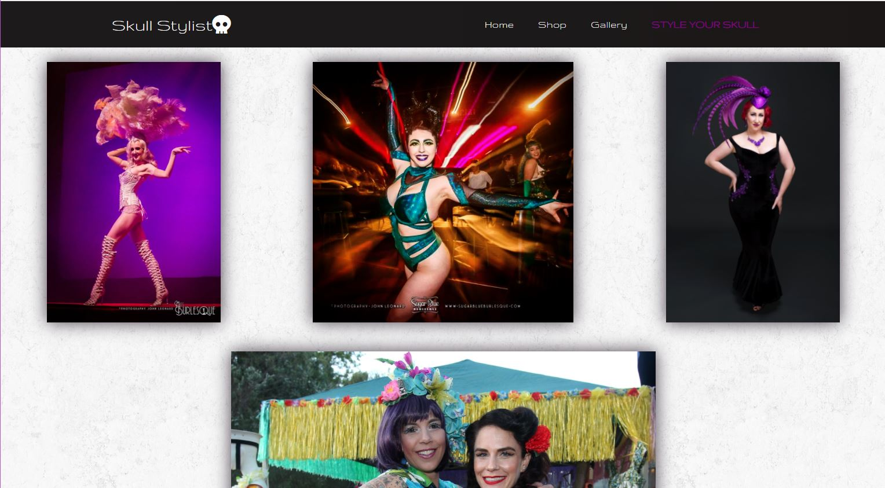

# Skull Stylist Website

## Description
Style your skull with custom, bespoke, locally made Millinery!

## User Story
```
Perth, Western Australia, August 16th 2021- A student from the University of Western Australia Full Stack Coding Bootcamp, released a website for local small business millinery company, Skull Stylist. Custom, bespoke and handmade millinery displayed on a slick and easy to use website. The owner of Skull Stylist, Fifi Fontaine, is able to log onto the website and upload and display their new work, as well as process sales, accept custom orders and update the shop. This takes out the need for third party applications like Etsy and Ebay, so there are no processing fees, Ms Fontaine is able to manage the website herself and finally use the ‘shop now’ function on the Skull Stylist instagram account. The Skull Stylist website upgrades this small local business along with reducing costs and making it easier to track custom design requests. 
```


The Skull Stylist website uses:
- MERN mongoDB, Express, React, Node
- Javascript
- HTML
- CSS
- JSON
- Apollo
- GraphQL
- Emailjs
- Nodemon

## Installation 

To view Skull Stylist in your localhost
- Clone the repo 
- open your terminal and type `npm install`
- once the dependencies are installed, type `npm start`

## Usage

- When you first go to the Skull Stylist website, you are presented with a slick and sophisticated landing page. 
- The navigation bar has 4 tabs, Home, Shop, Gallery and Style Your Skull.
- The Home tab brings the user back to the landing page, this can be used throughout the app. 
- The Gallery tab takes the user to an image gallery showcasing Skull Stylist designs.
- The Shop tab takes the user to page that displays pre-made one-of-a-kind millinery items. It displays an image of the product, along with a name, price and description.
- The 'Style Your Skull' tab takes you to a contact form where you can contact Skull Stylist for a custom design or to enquire about a pre-made item you would like to purchase. On this form you enter your name, email and a message. This will then send the message directly to the Skull Stylist email address.

## Links

Github Repo: https://github.com/DanniWilton/Note-taker 
Heroku Depo: https://secret-shore-49921.herokuapp.com/

## Screen Captures




